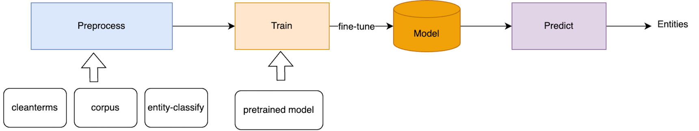

# BIOS NER
This project is used for **named entity recognition**(NER) in the **medical** field, and it helps us build a large-scale medical knowledge graph BIOS (https://bios.idea.edu.cn/).

This project refers to Transformer's [NER code](https://github.com/huggingface/transformers/tree/main/examples/legacy/token-classification).

## Install
`Python3.6` is recommended! For python3.7, see [issues 14559](https://github.com/huggingface/transformers/issues/14559).  
It is strongly recommended to train and predict on the GPU, so make sure you have the GPU and the correct CUDA installed on your device before working.
```commandline
sh env_setup.sh
```

## Modules
The following diagrams help you understand each module in the project, details can be found in each directory.


## Models
fine-tuned medical ner model can be downloaded from:  
链接: https://pan.baidu.com/s/12m05j0kFXdvutIfIzKMHtw  密码: dgkh

cleanterms can be downloaded from:  
链接: https://pan.baidu.com/s/1GXnsSa_39nbX_YdJVnQh2g  密码: 4501


## Citation
```bibtex
@misc{https://doi.org/10.48550/arxiv.2203.09975,
  doi = {10.48550/ARXIV.2203.09975},
  url = {https://arxiv.org/abs/2203.09975},
  author = {Yu, Sheng and Yuan, Zheng and Xia, Jun and Luo, Shengxuan and Ying, Huaiyuan and Zeng, Sihang and Ren, Jingyi and Yuan, Hongyi and Zhao, Zhengyun and Lin, Yucong and Lu, Keming and Wang, Jing and Xie, Yutao and Shum, Heung-Yeung},
  keywords = {Computation and Language (cs.CL), Machine Learning (cs.LG), FOS: Computer and information sciences, FOS: Computer and information sciences},
  title = {BIOS: An Algorithmically Generated Biomedical Knowledge Graph},
  publisher = {arXiv},
  year = {2022},
  copyright = {Creative Commons Attribution Non Commercial Share Alike 4.0 International}
}

```
