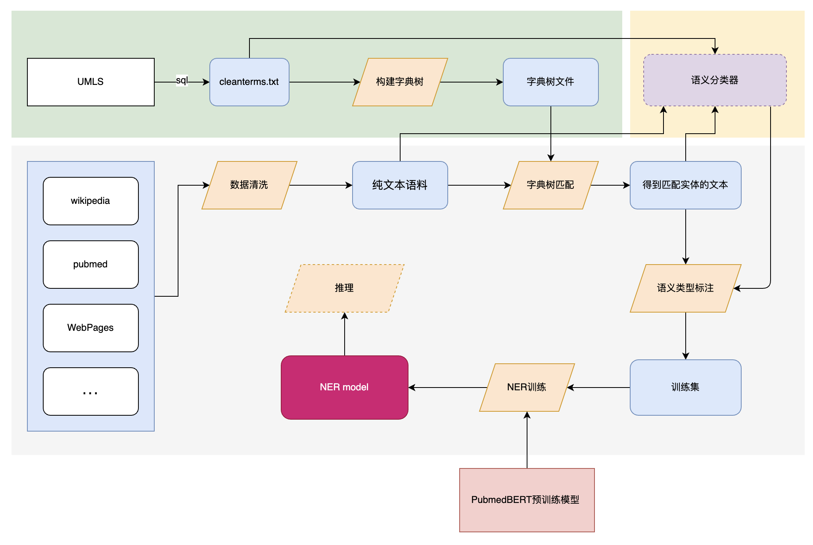

# BIOS NER
This project is used for **named entity recognition**(NER) in the **medical** field, and it helps us build a large-scale medical knowledge graph BIOS (https://bios.idea.edu.cn/).


## NER Pipeline
A high-quality training set is the basis for a reliable supervised learning NER model, for which some additional work is required to implement training set annotation. The complete pipeline is shown in the figure below, and the details of some dependencies could be found in other projects under this group.


## Install

```commandline
pip3 install -r requirements.txt
```
## Data Annotation
TODO
## Training
TODO
