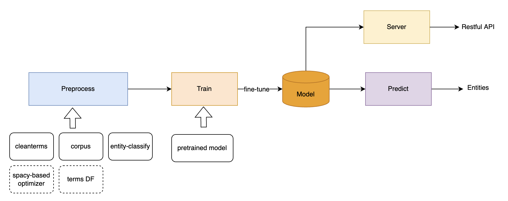

# BIOS NER
## Contents

- [Overview](#overview)
- [Repo Contents](#repo-contents)
- [System Requirements](#system-requirements)
- [Installation Guide](#installation-guide)
- [Demo](#demo)
- [License](./LICENSE)
- [Issues](https://github.com/bios-xiajun/bios_ner/issues)
- [Citation](#citation)

## Overview

The NER model employed in [BIOS]((https://bios.idea.edu.cn/)) is the standard BERT sequential classifier.
Our approach of using automated annotation to generate training data belongs to the distant supervision (DS-NER) category.


## Repo Contents
- [pretrain](./pretrain): scripts for downloading pretrained models
- [example](./example): small dataset to demo the code
- [preprocess](./preprocess): prepare training data using automated annotation  
- [train](./train): train codes
- [predict](./predict): predict codes
- [utils](./utils): utils codes

## System Requirements
### Hardware Requirements
For optimal performance, we recommend a computer with following specs:
  
RAM: 16+ GB  
CPU: 4+ cores, 3.3+ GHz/core  
GPU Memory: 40 GB  

### Software requirements
The package is tested on `Linux 20.04` operating system.
`Python3.6` is recommended!  For python3.7, see [issues 14559](https://github.com/huggingface/transformers/issues/14559).  

#### Install requirements
``
!pip install -r requirements.txt
``

## Installation Guide
  1. Download [cleanterms5.txt](https://pan.baidu.com/s/1e7hzcl6ZVTu_euwZBDVV2w) (password: d9ol) and put it under `./example/cleanterms/`.
  2. Download pretrained models: `cd pretrain && sh download_pubmedbert.sh`  
which will take about a few minutes to complete the download.
     
## Demo
### Preprocess
Prepare train/dev/test datasets.  
Make sure `cleanterms5.txt` has been downloaded, and then:
```commandline
1. cd preprocess
2. bash run.sh
```
Expect result: train/dev/test.txt under `../example/data/ner_train`
Expect time: about 2-3 minutes.

### Train
Make sure `pretrained model` has been downloaded, and then:
```commandline
1. cd train
2. sh train.sh
```  
Expect result:  fine-tuned model under `../example/data/ner_train/output`  
Expect time cost: about 5 minutes.  
*The evaluation result may be not good due to small training datasets.*

### Predict
configure [fine-tuned model path](https://pan.baidu.com/s/13q4c0XfMsBSwM3w77HbXxw) (password: igg3) in the predict.sh, and then:
```commandline
1. cd predict
2. bash predict.sh
```
Expect result: predictions for NER under `../example/data/ner_predict`  
Expect time cost: about 1 minute.

## Instructions for use
1. generate your cleanterms.txt from UMLS by your rules.
   
2. prepare your training texts and the STA results using [STA model]( https://github.com/bios-xiajun/bios_entity_classification).

3. use your datasets to train and predict!


## Citation
```text
@misc{https://doi.org/10.48550/arxiv.2203.09975,
  doi = {10.48550/ARXIV.2203.09975},
  url = {https://arxiv.org/abs/2203.09975},
  author = {Yu, Sheng and Yuan, Zheng and Xia, Jun and Luo, Shengxuan and Ying, Huaiyuan and Zeng, Sihang and Ren, Jingyi and Yuan, Hongyi and Zhao, Zhengyun and Lin, Yucong and Lu, Keming and Wang, Jing and Xie, Yutao and Shum, Heung-Yeung},
  keywords = {Computation and Language (cs.CL), Machine Learning (cs.LG), FOS: Computer and information sciences, FOS: Computer and information sciences},
  title = {BIOS: An Algorithmically Generated Biomedical Knowledge Graph},
  publisher = {arXiv},
  year = {2022},
  copyright = {Creative Commons Attribution Non Commercial Share Alike 4.0 International}
}
```


